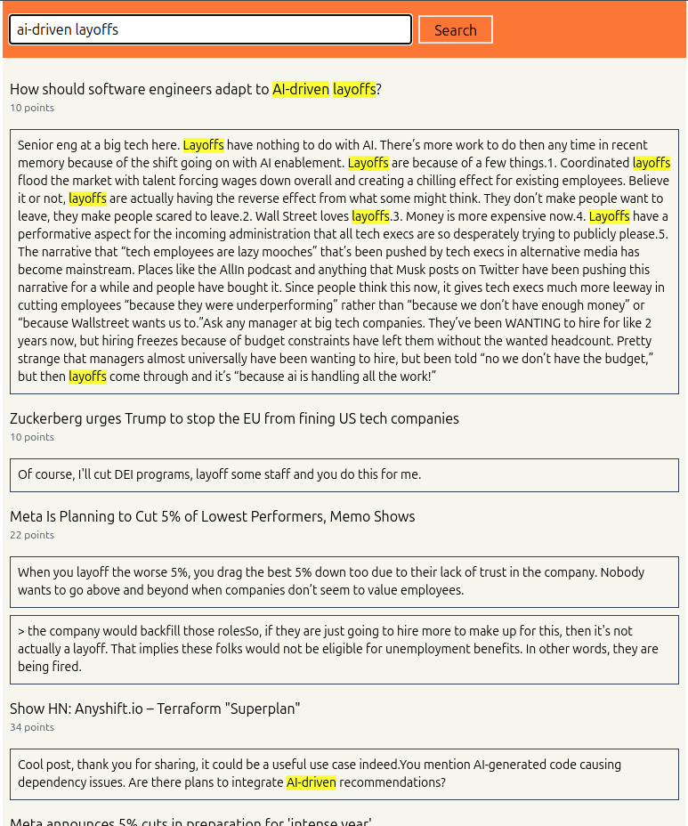

### Search Engine for Hackernews
Simple search engine implementation. Deployed at https://hnsearch.mnprt.me/ .


### Tokenizer
Only stores individual words as tokens after removing stop words using [this]("github.com/bbalet/stopwords"
"github.com/reiver/go-porterstemmer") stop word library. Stemming is done using [port-stemming library]("github.com/reiver/go-porterstemmer").

### Indexing
Uses [official hn-api](https://github.com/HackerNews/API) to find stories
and their comments. Only stories with >= 5 points are indexed. The indexer
is backed by db i.e. it can be safely stopped
and resumed in the future.

Only Stories and their top level comments are fetched and indexed.

### Search
Search uses BM25 algorithm to rank the documents.

### Configuration
Behavior can be configured using the `.env` file.
```
DB_USER="testuser"
DB_PASSWORD="testpassword"
DB_NAME="testdb"
DB_HOST="db"
DB_PORT="5432"
START_INDEX=false // whether you want to start indexing
MAX_ITEMS=8000 // max number of items to index (item = story + comment)
```

### Deployment
`docker compose up --build`

